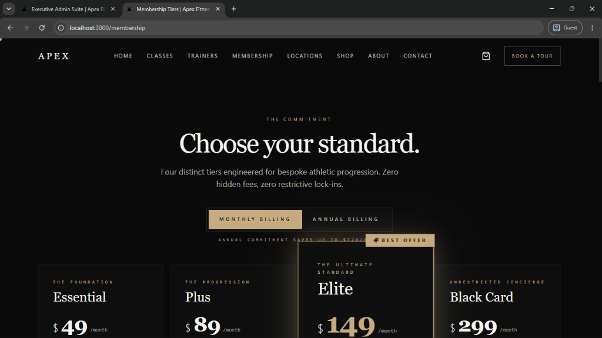
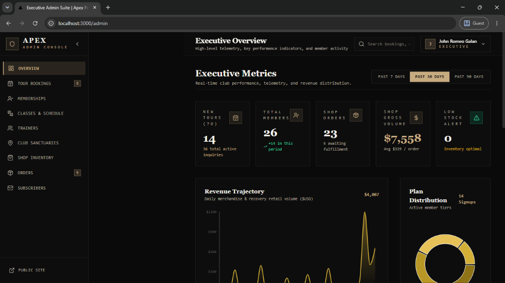

<div align="center">

# ▲ APEX FITNESS GYM
### Private Members' Club · Manila · Beyond Limits

[](https://nextjs.org/)
[](https://reactjs.org/)
[](https://www.typescriptlang.org/)
[](https://tailwindcss.com/)
[](https://www.framer.com/motion/)
[](https://leafletjs.com/)
[](#system-performance--engineering)

<p align="center">
  <b>A bespoke digital sanctuary engineered for elite athletic progression and private clubhouse admissions.</b><br />
  Designed with an architectural dark luxury aesthetic in obsidian black, brushed concrete, and champagne gold.
</p>

[Explore Features](#key-features) · [Quick Start](#getting-started) · [Admin Suite](#executive-admin-suite) · [Architecture](#system-performance--engineering)

---

### Platform Preview

| Membership Admissions & Tier Matrices | Executive Admin Suite & Telemetry |
| :---: | :---: |
|  |  |

</div>

---

## Table of Contents

- [Overview](#overview)
- [Key Features](#key-features)
  - [Iconic Welcoming Sequence](#1-iconic-theatrical-welcoming-screen)
  - [Club Sanctuary Network & Zero-API Map](#2-club-sanctuary-network--zero-api-dark-map)
  - [Curriculum & Weekly Master Schedule](#3-curriculum--weekly-master-schedule)
  - [Tiered Admissions & Comparison Matrix](#4-tiered-admissions--comparison-matrix)
  - [Specialist Master Trainers](#5-specialist-master-trainers)
  - [Boutique Pro Shop & Bag](#6-boutique-pro-shop--bag)
  - [Executive Admin Suite](#7-executive-admin-suite)
- [System Performance & Engineering](#system-performance--engineering)
  - [60fps to 144fps+ High-Refresh Scroll](#60fps-to-144fps-high-refresh-rate-scrollability)
  - [Mobile-First Responsiveness](#mobile-first-responsiveness)
  - [Ultra-Wide & Native 4K UHD Readiness](#ultra-wide--native-4k-uhd-readiness)
- [Tech Stack](#tech-stack)
- [Project Architecture](#project-architecture)
- [Getting Started](#getting-started)
- [Design Tokens & Palette](#design-tokens--palette)
- [Author & License](#author--license)

---

## Overview

**Apex Fitness Gym** is a flagship private members' athletic clubhouse platform positioned across Metro Manila's premier enclaves (Bonifacio Global City, Makati, Ortigas, Alabang, New Manila). 

The platform merges brutalist architectural aesthetics with fluid digital interactions—providing members with real-time class timetables, interactive clubhouse maps, private tour consultations, and an integrated boutique shop, while providing club directors with a comprehensive executive management console.

---

## Key Features

### 1. Iconic Theatrical Welcoming Screen
* **Theatrical Curtain Rise:** Deep obsidian (`#070707`) background with glowing ambient champagne radial light.
* **Monogram & Typography Reveal:** Masked vertical entrance for the **APEX** logotype, geometric emblem (`▲`), and expanding gold horizon rule.
* **Zero-Friction UX:** Automatically advances in ~2.1 seconds or allows instant skip on any click/tap. Locks body scroll during sequence to eliminate layout shifting.
* **Accessibility:** Honors `prefers-reduced-motion` settings.

### 2. Club Sanctuary Network & Zero-API Dark Map
* **Zero-API-Key Dark Map Shader:** High-contrast, inverted Google Maps satellite/road tile pipeline requiring **zero external API keys or billable tokens**.
* **Smooth Flight Hover Telemetry (`map.flyTo`):** Hovering over any club card seamlessly glides and recenters the Leaflet viewport with custom cubic easing.
* **Dual-View Modes:** Instant toggle between Split (List + Map), List Only, and Map Only views.
* **Proximity Geo-Sorting & Filtering:** Geolocation-based distance calculation, district chips (Taguig, Makati, Pasig, Alabang, QC), and multi-select amenity filters (Pool, Sauna, Boxing, Cycling, 24/7).
* **Location Dossiers:** Dedicated dynamic clubhouse routes (`/locations/[slug]`) featuring full-bleed Ken Burns hero imagery, operating hours status chips (Open Now / 24 Hours), asymmetric masonry photo archival with lightbox, and direct Google Maps navigation CTAs.

### 3. Curriculum & Weekly Master Schedule
* **16 Specialist Disciplines:** Filterable across 8 athletic categories (*Strength, HIIT, Cycling, Pilates, Yoga, Boxing, Recovery, Foundation*).
* **Interactive 7-Day Timetable:** Live slots with start/finish times, trainer assignments, remaining spot counters, and direct booking triggers.
* **Detail Drawers:** Equipment specifications, target heart rates, neurological fatigue ratings, and suggested prerequisites.

### 4. Tiered Admissions & Comparison Matrix
* **Four Membership Tiers:** *Essential ($49/mo)*, *Plus ($89/mo)*, *Elite ($149/mo - Best Offer)*, and *Black Card ($299/mo)*.
* **Interactive Billing Toggle:** Real-time switch between Monthly and Annual billing with animated pill indicators and ~20% discount calculations.
* **Comprehensive Comparison Matrix:** In-depth breakdown covering facility access, guest privileges, thermal suites, personal training sessions, and corporate perks.
* **Membership Registration Modal:** Multi-step admissions drawer with tier pre-selection, billing interval selection, and form validation.

### 5. Specialist Master Trainers
* **Specialist Dossiers:** Coaching profiles featuring credentials, primary disciplines, coaching philosophy, and client transformation records.
* **Accessible Detail Modal:** Direct consultation request triggers and trainer timetable sync.

### 6. Boutique Pro Shop & Bag
* **E-Commerce Catalog:** Studio equipment, laboratory-tested supplements, and performance training wear.
* **Slide-Over Detail Drawer & Persistent Bag:** Real-time cart drawer with quantity increments, persistent storage, subtotal math, and badge bounce animation.
* **Checkout Flow:** Guest/member checkout with order summary and receipt routing (`/order/[id]`).

### 7. Executive Admin Suite
* Located at [`/admin`](file:///c:/Users/HP%20Laptop/aethelgard-fitness/src/app/admin/page.tsx) with collapsable sidebar navigation and mobile drawer.
* **Executive Metrics & Telemetry:** 7-day, 30-day, and 90-day telemetry for active tours, membership registrations, boutique orders, gross volume, and stock alerts.
* **Tour Booking Management:** Review, confirm, reschedule, or cancel walkthrough bookings.
* **Membership Registrations:** Review active member rosters, filter by tier, and update statuses.
* **Curriculum & Schedule Editor:** Add, modify, or remove class slots and masterclasses.
* **Trainers & Club Sanctuaries:** Manage resident coaching staff and flagship clubhouse metadata.
* **Inventory & Order Fulfillment:** Live stock monitoring, low-stock threshold triggers, and fulfillment tracking.
* **Newsletter Audience:** Export and inspect newsletter subscriber intakes.

---

## System Performance & Engineering

### 60fps to 144fps+ High-Refresh-Rate Scrollability
```
┌─────────────────────────────────────────────────────────────────┐
│                   High-Refresh-Rate Pipeline                    │
│                                                                 │
│   DOM Virtualization       GPU Compositor Layers    rAF Throttling
│  [content-visibility]  ──►  [translate3d / will-change] ──► [60-144fps]
└─────────────────────────────────────────────────────────────────┘
```
1. **DOM Virtualization with `content-visibility: auto`**:
   Heavy sections across all main views apply `.content-visibility-auto` and `contain-intrinsic-size: 1px 500px`. Off-screen DOM nodes skip layout and paint calculations until nearing the viewport, keeping scroll frames locked at 120Hz/144Hz+.
2. **GPU Hardware Promotion**:
   Continuous ambient animations (`.animate-kenburns`, `.animate-marquee`, `.animate-shimmer`, `.animate-float-badge`, `.animate-shine-sweep`) utilize `transform: translate3d(0, 0, 0)` and `will-change: transform` to run exclusively on the GPU compositor thread without triggering main-thread repaints.
3. **Throttled Scroll Handlers**:
   Window scroll listeners (Sticky CTA, Location scroll-spy) are wrapped in `requestAnimationFrame` ticking guards to prevent layout thrashing.

### Mobile-First Responsiveness
* **Zero-Delay Touch:** `touch-action: manipulation` across all interactive elements (`button`, `a`, `input`, `select`) eliminates the default 300ms mobile tap delay.
* **Momentum Scrolling:** Enabled native `-webkit-overflow-scrolling: touch` for iOS Safari.
* **44px Touch Targets:** Strict adherence to mobile accessibility minimum target sizes across all buttons, filter chips, and navigation links.

### Ultra-Wide & Native 4K UHD Readiness
* **Next.js Image Pipeline:** Configured `deviceSizes: [640, 750, 828, 1080, 1200, 1920, 2048, 2560, 3840]` in `next.config.mjs` for native 4K UHD rendering.
* **Tailwind Breakpoint Matrix:** Custom `'3xl': '1920px'`, `'4k': '2560px'`, and `'4k-uhd': '3840px'` utilities.
* **Architectural Boundaries:** Layout containers apply proportional constraints (`max-w-7xl 3xl:max-w-[1700px] 4k:max-w-[2200px] mx-auto`) so typography and grids scale with majestic balance without stretching.

---

## Tech Stack

| Layer | Technologies |
| :--- | :--- |
| **Framework** | [Next.js 14](https://nextjs.org/) (App Router, Server & Client Components) |
| **Language** | [TypeScript 5](https://www.typescriptlang.org/) (Strict Mode) |
| **Styling** | [Tailwind CSS 3.4](https://tailwindcss.com/), [PostCSS](https://postcss.org/), `tailwindcss-animate` |
| **Motion** | [Framer Motion 11](https://www.framer.com/motion/) |
| **Mapping Engine** | [Leaflet](https://leafletjs.com/) with Zero-API-Key Dark Shader Tile Pipeline |
| **UI Primitives** | [Radix UI](https://www.radix-ui.com/), [Lucide React](https://lucide.dev/) Icons |
| **Notifications** | [Sonner](https://sonner.emilkowal.ski/), Radix Toaster |
| **State & Storage** | React Context (`CartContext`), Local Mock Database API Client |

---

## Project Architecture

```
aethelgard-fitness/
├── docs/
│   └── images/                     # Platform preview screenshots
├── public/                         # Public assets and icons
├── src/
│   ├── api/                        # Mock REST Client & Entity services
│   ├── app/                        # Next.js 14 App Router
│   │   ├── (main)/                 # Main member-facing route group
│   │   │   ├── layout.tsx          # Shared consumer layout
│   │   │   ├── page.tsx            # Homepage route
│   │   │   ├── classes/            # Classes & Masterclasses
│   │   │   ├── trainers/           # Trainers directory
│   │   │   ├── locations/          # Club network & location detail
│   │   │   ├── membership/         # Tiers & comparison matrix
│   │   │   ├── shop/               # Boutique catalog & checkout
│   │   │   └── book-tour/          # Walkthrough booking
│   │   ├── admin/                  # Executive Admin Suite
│   │   ├── layout.tsx              # Root HTML & font configuration
│   │   └── sitemap.ts              # Dynamic XML sitemap generator
│   ├── components/                 # Reusable UI & Layout Components
│   │   ├── admin/                  # Admin dashboard panels & sidebar
│   │   ├── home/                   # Hero & homepage modules
│   │   ├── locations/              # Leaflet Map & location cards
│   │   ├── membership/             # Pricing cards & comparison table
│   │   ├── shop/                   # Product cards, drawer, & cart
│   │   ├── ui/                     # Primitives (button, dialog, toast, etc.)
│   │   ├── Header.tsx              # Adaptive responsive navbar
│   │   ├── Footer.tsx              # Brand footer & newsletter intake
│   │   ├── Loader.tsx              # Iconic brand welcoming screen
│   │   └── StickyCTA.tsx           # Mobile sticky tour reservation CTA
│   ├── data/                       # Mock clubs, trainers, products, classes
│   ├── hooks/                      # Custom hooks (scroll direction, size)
│   ├── lib/                        # Utilities, motion presets, cart context
│   ├── types/                      # TypeScript domain models
│   └── index.css                   # Tailwind layers, GPU compositing & shaders
├── next.config.mjs                 # Next.js 4K image device sizes & cache rules
├── tailwind.config.js              # Theme extensions, 4K breakpoints, colors
└── tsconfig.json                   # Strict TypeScript compiler options
```

---

## Getting Started

### Prerequisites
* **Node.js**: v18.17.0 or higher
* **npm** or **yarn** / **pnpm**

### Installation

1. **Clone the repository:**
   ```bash
   git clone https://github.com/jrbgalan/apex-fitness.git
   cd apex-fitness
   ```

2. **Install dependencies:**
   ```bash
   npm install
   ```

3. **Start the local development server:**
   ```bash
   npm run dev
   ```

4. **Access the application:**
   * **Public Platform:** Open [http://localhost:3000](http://localhost:3000)
   * **Executive Admin Suite:** Navigate to [http://localhost:3000/admin](http://localhost:3000/admin)

### Production Build

```bash
# Build optimized production bundle
npm run build

# Start production server
npm run start
```

---

## Design Tokens & Palette

| Token | Hex / HSL | Usage |
| :--- | :--- | :--- |
| **Obsidian Black** | `#070707` / `0 0% 3.9%` | Core backdrop, structural panels |
| **Card Surface** | `#111111` / `0 0% 6%` | Elevated cards, drawers, dialogs |
| **Champagne Gold** | `#d4af37` / `36 38% 64%` | Accent borders, markers, primary CTAs |
| **Pale Champagne** | `#f5e6a3` | Active map pulses, hover glows |
| **Ivory Light** | `#f5f5f5` / `40 30% 95%` | Primary headings, high-contrast labels |
| **Muted Fog** | `#a1a1aa` / `40 10% 65%` | Secondary prose, archival notes |

* **Headings:** *Playfair Display* & *Cormorant Garamond* (Serif, Editorial Luxury)
* **Body:** *Inter* (Sans-serif, Biomechanical Precision)
* **Telemetry & Time:** System Monospace (Clean, Functional Telemetry)

---

## Author & License

* **Author:** **John Romeo Galan** ([@jrbgalan](https://github.com/jrbgalan) · `jrbgalan@gmail.com`)
* **License:** [MIT License](LICENSE) © 2026 John Romeo Galan. All rights reserved.
